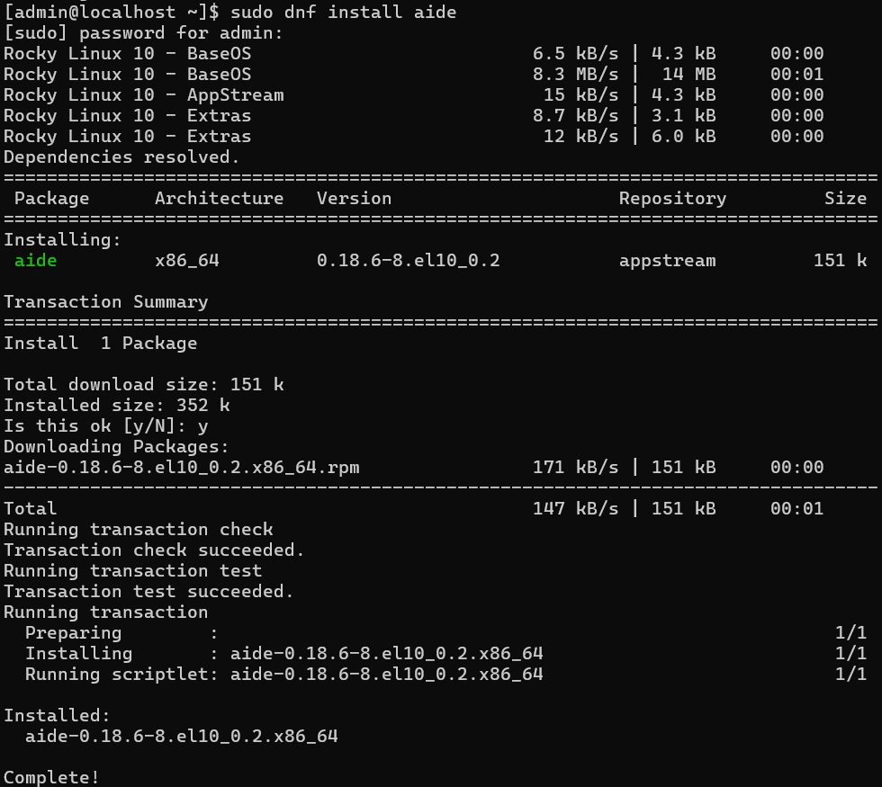
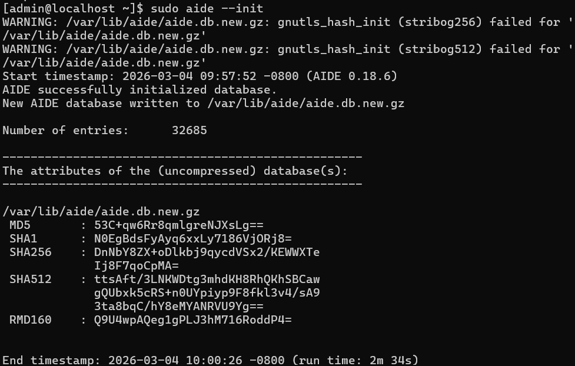
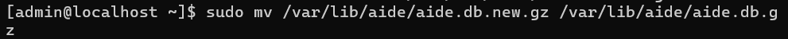
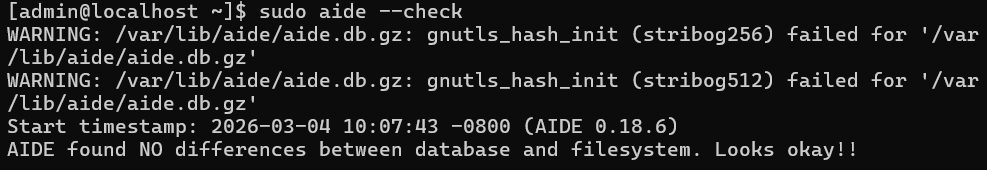
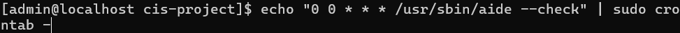

<h1>Harden Rocky Linux to CIS Benchmark</h1>

<h2>Description</h2>
Project demonstrates the hardening of a Rocky Linux 10 minimal server to CIS Level 1 standards using OpenSCAP. A baseline compliance scan was performed, targeted remediation was applied, and post-remediation validation confirmed improved security posture. Advanced security controls were then implemented, including SSH key-only authentication, auditd process execution logging, firewall segmentation, file integrity monitoring (AIDE), and centralized logging preparation.

This project simulates enterprise Linux server hardening and security engineering practices.
 

<h2>Languages and Utilities Used</h2>

- <b>OpenSCAP</b> 
- <b>SSH</b>
- <b>firewalld</b>
- <b>auditd</b>
- <b>AIDE</b>
- <b>Bash scripting</b>

<h2>Environments Used </h2>

- <b>Rocky Linux 10 (Minimal Install)</b>

<h2>Program walk-through:</h2>

 1. OpenSCAP and SSH 
  

 Update the system to ensure all packages are current before performing compliance scanning.       

 Install OpenSCAP scanner and SCAP Security Guide content required for CIS evaluation.          

 Inspect available compliance profiles within the SCAP datastream.       

 Execute initial CIS Level 1 scan to establish compliance baseline.       

 Baseline report showing 116 failed rules and ~79% compliance score prior to remediation.       

 Generate automated remediation script for CIS Level 1 profile.       

 Generate list of SSH rules for custom SSH remediation script       

 Generate ed25519 key pair for secure SSH key-only authentication and deploy to authorized_keys       

 Execute custom SSH-only remediation script derived from full CIS remediation output.       

 Results from SSH-only remediation script       

 Verify SSH access post-remediation.       

 2. Auditd 
  

 Verify auditd service status       

 Configure log retention       

 Create dedicated file with rules       

 Create rule set       

 Load rule set       

 Verify rules are laoded       

 Test rules by creating events       

 Search events      

     

 3. AIDE 
  

 Install AIDE      

 Create systemd service and timer file for scheduled checks      

    

    

      

 Configure AIDE to verify audit tools      

      

 Enable and start service      

 Initialize AIDE scan and promote the new database      

    

 Test a check against the new database      

 Testing the evaluation of AIDE rules show two were remediated, while verifying audit tools and crontab failed      

 Rsyslogd rule was missing, so I added an rsyslogd rule to aide.conf      

 Although I created a timer using systemd, the OSCAP rule is looking for a root crontab entry      

 Evaluated the AIDE rules again, this time with a pass        

 4. Firewalld 
  

 Check firewalld status      

 Remove unnecessary services (cockpit and dhcpv6)      

 Configure the lo interface to be in the trusted zone, and deny loopback address traffic from any other interface      

 Evaluate firewalld results      

